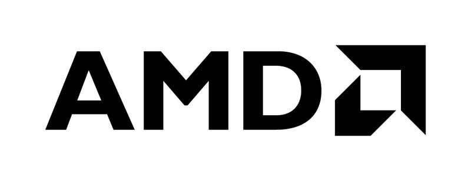

# AMD GPU Operator




The AMD GPU Operator simplifies the deployment and management of AMD Instinct GPU accelerators within Kubernetes clusters. This project enables seamless configuration and operation of GPU-accelerated workloads, including machine learning, Generative AI, and other GPU-intensive applications.

## Features

- Automated driver installation and management
- Easy deployment of the AMD GPU device plugin
- Metrics collection and export
- Support for both vanilla Kubernetes and OpenShift environments
- Simplified GPU resource allocation for containers
- Automatic worker node labeling for GPU-enabled nodes

## Compatibility

- **ROCm DKMS Compatibility**: Please refer to the [ROCM official website](https://rocm.docs.amd.com/en/latest/compatibility/compatibility-matrix.html) for the compatability matrix for ROCM driver.
- **Kubernetes**: 1.29.0+
- **OpenShift**: 4.16+

## Prerequisites

- Kubernetes (v1.29.0+) or OpenShift (4.16+)
- Helm v3.2.0+
- `kubectl` or `oc` CLI tool configured to access your cluster

## Quick Start

1. Add the Helm repository:

```bash
helm repo add rocm https://rocm.github.io/gpu-operator
helm repo update
```

2. Install the AMD GPU Operator:

```bash
helm install amd-gpu-operator rocm/gpu-operator-helm --namespace kube-amd-gpu --create-namespace
```

3. Verify the installation:

```bash
kubectl get pods -n kube-amd-gpu
```

For more detailed installation instructions and configuration options, please refer to our [Installation Guide](docs/installation.md).

## Developer Guide

For developers, please refer to our [Developer Guide](docs/docs/development/developer-guide.md) to get instructions about:
* Setup development environment
* Apply customized change to build Helm charts and container images

## Documentation

Project documentation is available [here](docs/docs/index.md)

**TODO:** Update with permanent documentation site link.

## Support

For bugs and feature requests, please file an issue on our [GitHub Issues](https://github.com/ROCm/gpu-operator/issues) page.

## License

The AMD GPU Operator is licensed under the [Apache License 2.0](LICENSE).